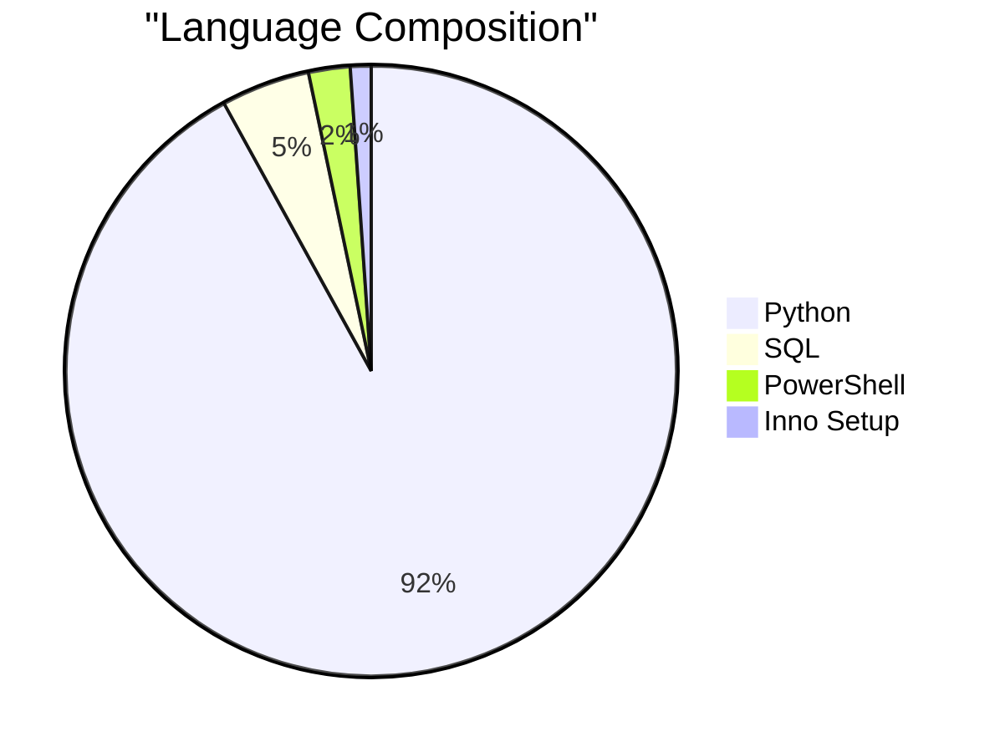
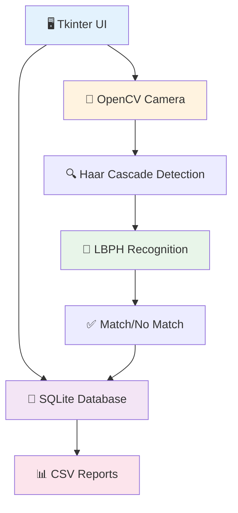
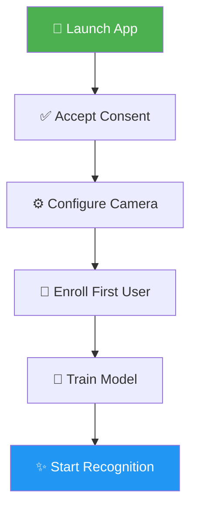
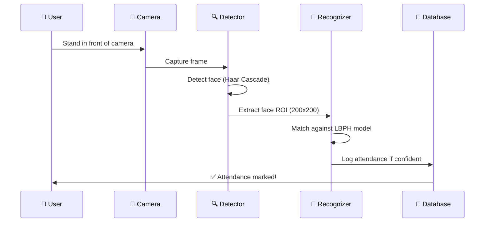

<div align="center">

# 🎯 FaceID Attendance App

### *Intelligent Face Recognition Attendance System*


**A Python-based Face ID Attendance Application that uses facial recognition to automatically mark and manage attendance. Capture faces via webcam, match them against a registered database, log check-in/check-out times, and export attendance reports.**

[📥 Download](#-download) • [✨ Features](#-features) • [📖 Documentation](#-table-of-contents) • [🚀 Quick Start](#-quick-start-windows)

</div>

---

## 📥 Download

<div align="center">

### 🪟 Windows Application (No Python Required)

**Latest Release:  v1.0.1**

[](https://github.com/absid10/FaceID-Attendance-App/releases/download/v1.0.1/FaceAttendance-v1.0.1-windows.zip)
[](https://github.com/absid10/FaceID-Attendance-App/releases/download/v1.0.1/FaceAttendance.exe)

[](https://github.com/absid10/FaceID-Attendance-App/releases)

**📊 File Size:** ~50MB | **✅ Verified:** SHA256 Checksums Available

</div>

---

## 📊 Project Overview


### 🔧 Technology Stack



---

## 🖼️ App Preview

Below are in-app screenshots of the console and live capture view:

- Admin console with quick actions, model insights, and recent attendance  
  

- Live attendance capture with recognition bounding box and confidence  
  

---

## ✨ Features

<table>
<tr>
<td width="50%">

### 👨‍💼 **Admin Console**
- ✅ **Enroll New Users** - Guided face capture process
- 🧠 **Train AI Model** - Build recognition model
- 📋 **Log Attendance** - Automated session tracking
- 👥 **User Management** - Manage registered users
- 📊 **Export Reports** - Daily/Weekly/Monthly CSV exports

</td>
<td width="50%">

### 👤 **User Dashboard**
- 📝 **Self-Service Enrollment** - Request form submission
- 🔐 **Privacy Controls** - Consent management
- 📱 **Kiosk Mode** - Dedicated attendance terminal
- 🎯 **Real-time Recognition** - Instant face matching
- 🔒 **Data Privacy** - Local-only storage

</td>
</tr>
</table>

---

## 🏗️ System Architecture



---

## 🚀 Quick Start (Windows)

### Step 1: Download & Extract
```
📦 Download FaceAttendance-v1.0.1-windows.zip
📂 Extract to Desktop\FaceAttendance
🖱️ Double-click FaceAttendance.exe
```

### Step 2: Initial Setup



1. ✅ **Accept** the consent prompt  
2. ⚙️ **Open Settings** → Confirm Camera Index  
3. 👤 **Admin Console** → Enroll New Face  
4. 🧠 **Admin Console** → Train Recognition Model  
5. 📋 **Admin Console** → Log Attendance Session  

> 💡 **Tip:** See [RUN_WINDOWS.txt](RUN_WINDOWS.txt) for detailed instructions

---

## 🎯 How It Works

### Recognition Pipeline



### Data Flow

1. **📸 Enroll**: Capture face samples → `data/dataset/`  
2. **🧠 Train**: Build LBPH model → `models/trainer.yml`  
3. **🎯 Recognize**: Match faces → Log to SQLite  
4. **📊 Export**: Generate CSV reports  

---

## 💻 Run from Source (Developers)

### Prerequisites
- 🪟 Windows 10/11
- 🐍 Python 3.10+

### Installation

```powershell
# Create virtual environment
py -3 -m venv .venv

# Activate environment
.\.venv\Scripts\activate

# Install dependencies
python -m pip install -r requirements.txt

# Launch application
python frontend/attendance_app.py
```

### Optional Manual Scripts
```powershell
python scripts/01_create_dataset.py
python scripts/02_train_model.py
```

---

## 💾 Data Storage & Privacy

### 🗃️ Database Schema (SQLite)

**File:** `data/attendance.sqlite3`

| Table | Purpose |
|-------|---------|
| 👥 `users` | Registered user information |
| 📋 `attendance` | Check-in/out timestamps |
| 📝 `enrollment_requests` | Self-service enrollment queue |

> 📖 See [backend/schema.sql](backend/schema.sql) for full schema

### 📁 Local Storage Structure

```
FaceAttendance/
├── 📂 data/
│   ├── 💾 attendance.sqlite3      # Primary database
│   └── 📂 dataset/                # Face images (local-only)
├── 📂 models/
│   └── 🤖 trainer.yml             # Trained LBPH model
└── 📂 logs/
    └── 📄 faceattendance.log      # Application logs
```

### 🔒 Privacy & Security

- ✅ **100% Local Storage** - No cloud uploads  
- ✅ **Consent Required** - First-run privacy agreement  
- ✅ **Privacy Mode** - Disable enrollment/training  
- ⚠️ **Biometric Data** - Never commit face images to Git  
- 🔐 **Portable Mode** - Data stays with the EXE folder  

---

## ⚙️ Configuration & Settings

### Settings Panel Options

| Setting | Description | Default |
|---------|-------------|---------|
| 📹 Camera Index | Webcam device ID | 0 |
| ⏱️ Session Duration | Recognition session length | 60s |
| 🎯 LBPH Threshold | Match tolerance (higher = lenient) | 50 |
| 🔄 Duplicate Window | Prevent re-logging interval | 5 min |
| 🔒 Privacy Mode | Disable enrollment/training | Off |

### Kiosk Mode

```powershell
python frontend/attendance_app.py --kiosk
```
**Output:** `release/FaceAttendance.exe`

---

## 🤖 Automated Releases (CI/CD)

### GitHub Actions Workflow


**Trigger a release:**
```powershell
git tag v1.0.2
git push origin v1.0.2
```

**Artifacts Generated:**
- ✅ `FaceAttendance.exe`
- ✅ `FaceAttendance-v1.0.2-windows.zip`
- ✅ `checksums.sha256`

---

## 🐛 Troubleshooting

| Issue | Solution |
|-------|----------|
| ⚡ Enroll popup flashes | Update to latest release |
| 📹 Camera won't open | Close other apps using camera; check Settings → Camera Index |
| 🤖 Model missing error | Enroll ≥1 user and train the model |
| ❌ Missing `cv2.face` | Install `opencv-contrib-python` instead of `opencv-python` |
| 📋 Check logs | See `logs/faceattendance.log` |

---
```
FaceID-Attendance-App/
├── 🖥️ frontend/              # Tkinter UI (attendance_app.py)
├── ⚙️ backend/               # Core logic + SQLite storage
├── 📜 scripts/               # Dataset capture + training scripts
├── 🎨 assets/                # Haar cascade + resources
├── 💾 data/                  # Database + CSV templates
├── 🤖 models/                # Trained model output
├── 🔧 .github/workflows/     # CI/CD automation
└── 📖 docs/                  # Documentation
```

---
## 📈 Project Stats

<div align="center">


</div>

---
## 📄 License

This project is open source. See the [LICENSE](LICENSE) file for details.

---

<div align="center">

**Made with ❤️ using Python, OpenCV, and Tkinter**

[⬆ Back to Top](#-faceid-attendance-app)

</div>
